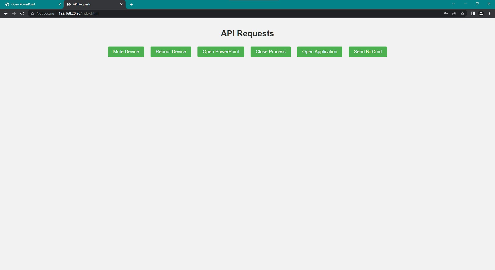
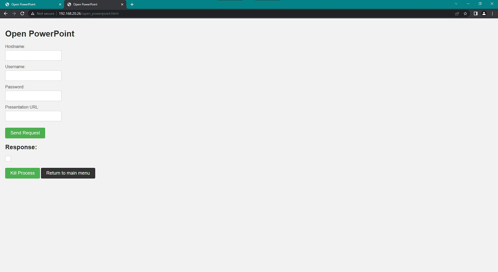

# Innovation Hub Device Control API

---

pull to local via:
```bash
git clone --single-branch --branch master https://github.com/Latrobe-Innovation-Hub/innovation-hub-controller-API-CONTAINER.git  
```

---

**directory structure**  
```bash
project
├── container1
│   ├── docker-entrypoint.sh
│   ├── Dockerfile
│   ├── fail2ban			<- fail2ban config dir
│   │   ├── action.d
│   │   │   └── docker-iptables-multiport.conf
│   │   ├── fail2ban.local
│   │   ├── filter.d
│   │   │   └── nginx-http-auth.conf
│   │   ├── jail.d
│   │   │   └── nginx.conf
│   │   └── jail.local
│   ├── fixed_envsubst-on-templates.sh
│   ├── healthcheck.sh
│   ├── monit				<- monit watchdog config dir
│   │   ├── fail2ban.conf
│   │   ├── monitrc
│   │   └── nginx.conf
│   ├── nginx				<- nginx proxy config dir
│   │   ├── default.old
│   │   ├── html
│   │   │   ├── background.jpg
│   │   │   └── index.html
│   │   ├── nginx.conf
│   │   └── templates
│   │       └── default.conf.template
│   └── password_script.sh
├── container2
│   ├── api				<- Python Flask API config dir
│   │   ├── gunicorn_config.py
│   │   ├── api.py
│   │   ├── api_config.py
│   │   ├── requirements.txt
│   │   ├── start_api.sh
│   ├── docker-entrypoint.sh
│   ├── Dockerfile
│   ├── healthcheck.sh
│   └── monit				<- monit watchdog config dir
│       ├── gunicorn3.conf
│       └── monitrc
├── epson_projector			<- Epson projector Python remote control 
├──  scripts
    ├── password_script.sh		<- encrypted password script
    └── user_credentials.txt		<- example user:password file for script
├── README.md
├── docker-compose.yml
└── windows_ssh_psexec_setup.txt	<- guide for windows ssh/api access/control
```

---

### System Info
**names:**  
container1: reverse-proxy  
container2: api 
  
**services:**  
container1: nginx, fail2ban, monit   
container2: Flask (Python), Gunicorn, monit   
  
**container network:**  
subnet: 172.75.0.0/16   
container1 ip: 172.75.0.2   
container2 ip: 172.75.0.3   
  
**container persistent storage:**  
name: container_data:  
stores: logs (both containers), database (container1)  
container bind directory: /home/innovation-hub-api/persistent/  
  
**container1 persistent storage:**  
logs: /home/innovation-hub-api/persistent/logs/container1  
  
**container2 persistent storage:**  
logs: /home/innovation-hub-api/persistent/logs/container2

**container1 fail2ban nginx jail name:**  
nginx-http-auth
  
**Default API Access (through proxy; can be changed/removed):**  
Username: admin  
Password: admin

---

**Software Versions**  
container1:
  
| service            | source                        | version       |
| ------------------ | ----------------------------- | ------------- |
| Docker base Image  | Docker Hub (NGINX official)   | nginx:1.20.2  |
| NGINX              | Baked into base image         | 1.20.2        |
| Fail2ban           | Debian repository             | 0.11.2        |
| Monit              | Debian repository             | 5.27.2        |
  
container2:
  
| service            | source                        | version             |
| ------------------ | ----------------------------- | ------------------- |
| Docker base Image  | Docker Hub (Debian official)  | debian:stable-slim  |
| Pyython            | Debian repository             | 3.9.2               |
| SQLite             | Debian repository             | 3.34.1              |
| Gunicorn3          | Debian repository             | 20.1.0              |
| Monit              | Debian repository             | 5.27.2              |
  
---

**Environment Variables:**  
container1:
|                          |        |                                                                                             |
| ------------------------ | ------ | ------------------------------------------------------------------------------------------- |
| TZ                       | STRING | Sets timezone for container                                                                 |
| APP_PORT                 | INT    | Port to proxy to on container2, must match in both containers (defaults to 8050 if not set) |
| APP_IP                   | STRING | IP to proxy to on container2, must match IP set for container2				  |
| NET_SUBNET               | STRING | Network subnet for both containers - nginx - must match container_net                       |
| PROXY_LOG_LEVEL          | STRING | options: simple (no nginx access logging), detailed (with nginx access logging)             |
| NGINX_ERROR_LOG_LEVEL    | STRING | options: info, notice, warn, error, crit, alert, emerg (case sensitive)                     |
  
To get fail2ban to work with iptables requires container privilege capabilities to be used:  
```bash
cap_add:
  - CAP_NET_ADMIN
  - CAP_NET_RAW
```
  
container2:
|                          |        |                                                                                                   |
| ------------------------ | ------ | ------------------------------------------------------------------------------------------------- |
| TZ                       | STRING | Sets timezone for container                                                                 |
| APP_WORKERS              | INT    | Gunicorn workers - defaults to number of cores                                                    |
| APP_THREADS              | INT    | Gunicorn threads - defaults to number of cores – 1                                                |
| APP_PORT                 | INT    | listening port for Gunicorn WSGI, must match in both containers (defaults to 8050 if not set)     |
| APP_LOG_LEVEL            | STRING | options: debug, info, warning, error, critical                                                    |

---

**For further explanation of each container settings see relevant file for comments:**  
docker-compose.yamp - container start, env, and runtime settings: storage, networking  
Dockerfile - for image build settings  
docker-entryfile.sh - for runtime start process, services, file management, logging  
healthcheck.sh - for docker healtcheck status request response  
  
**See relevent container sub-dir for releveant service configurations**  
/monit - for watchdog service  
/nginx - for proxy service  
/fail2ban -  for authentification ip banning service  
/api - for python flask api application service  

---

### Container Roles
**Container1**  
Container1 serves as the primary handler for all incoming network requests within the container network. It acts as a proxy, directing permissible requests to container2 using its respective static IP address.  
  
To facilitate incoming requests, container1 employs the NGINX service, running on port 80. Access control for the container network is managed through NGINX's basic-auth feature, which relies on a user:password file (.htpasswd) to determine the appropriate access privileges. Notably, I have designed the system to allow the password file to be generated externally to the container. It can be passed in via the Dockerfile or shared using the --volume (-v) option in the docker-compose.yaml file.  
  
To address failed attempts at NGINX basic authentication, container1 integrates the Fail2ban service. Fail2ban continuously monitors the NGINX error log and records the IP addresses of unsuccessful access attempts for future reference. Should an IP address exceed five failed attempts within a specified time span (currently set at 10 minutes), it is automatically banned from accessing the network for a duration of 10 minutes. The number of attempts, the timeframe for attempts, and the ban duration can all be customized within Fail2ban's configuration file before building container1. Please refer to the authentication section for more detailed explanations.  
  
As of now, NGINX solely operates on port 80, and there is no immediate need for SSL. However, it is worth noting that this requirement might evolve in the future.
  
To ensure uninterrupted service, Monit serves as the watchdog handler, continuously monitoring the NGINX and Fail2ban services. If either of these services is found to be inactive or unresponsive, Monit takes necessary measures to restart them, guaranteeing the system's reliability.
  
**Container2**  
Container2 hosts the Innovation Hub API service, developed in Python. All web requests to and from the application are processed by the Web Server Gateway Interface (WSGI) Gunicorn.  
  
Container2 intentionally does not expose any ports externally. It is solely accessible from outside the container network via the container1 reverse proxy.  

---

### Logging:

location: /home/innovation-hub-api/persistent/logs/container2
  
Log format: 'YYYY-MM-DD HH:MM:SS [SOURCE] [LEVEL] file.ext: message'  
Example: '2022-03-15 11:11:41,522 [PYTHON] [INFO] api.py: init app server...'  

**Log Options**
Logging level and detail/verbosity can be set for both containers within the docker-compose.yaml file.  
  
Container1:  
The container log level can be set system-wide for nginx and fail2ban services.  Available options are info, notice, warn, error, crit, alert, or emerg  
  
There is also the choice to log all NGINX access requests or to turn this feature off.  Available options are simple (no nginx access logging), or detailed (with nginx access logging).  
  
Container2:  
The container log level can be set system-wide for the Gunicorn service.  Available options are debug, info, warning, error, or critical.  

---

### Watchdog Services:
**Container1:**  
Software: Monit  
Monitored Services: NGINX, Fail2ban  
Web Monitoring Portal: Yes  
  
Monit is configured to monitor the NGINX and Fail2ban services every 2 minutes. It provides status reports for each service and takes responsibility for restarting them if they are found to be inactive. NGINX is monitored using a PID file and the /healthcheck endpoint on port 80, which returns an HTTP code of 200 upon success. Fail2ban is monitored using a PID file and a socket.  
  
In addition, Monit offers a web portal for monitoring and controlling system services. This portal can be accessed through the NGINX reverse proxy feature on port 2812 of container1.  
  
To access Monit's web portal, visit http://localhost/monit/ and use the following credentials:  
Username: admin  
Password: admin  
  
Monit's configuration files are stored in the project directory: container1/monit/   
  
**Container2:**  
Software: Monit  
Monitored Service: Gunicorn3  
Web Monitoring Portal: No  
  
Monit is configured to monitor the Gunicorn3 service every 2 minutes. It provides status reports and handles the task of restarting the service if it is found to be inactive. Gunicorn is monitored using a PID file and the /ping endpoint on port 80. The /ping endpoint is located in the api.py file and returns the string "status: ok".  
  
Monit's configuration files are stored in the project directory: container2/monit/  
The Gunicorn restart script is stored in the project directory: container2/api/start_api.sh  

---

### Available service commands  
Monit commands (both containers):  
```bash
monit start all             				# Start all services  
monit start <name>          				# Only start the named service  
monit stop all              				# Stop all services  
monit stop <name>           				# Stop the named service  
monit restart all           				# Stop and start all services  
monit restart <name>        				# Only restart the named service  
monit monitor all           				# Enable monitoring of all services  
monit monitor <name>        				# Only enable monitoring of the named service  
monit unmonitor all         				# Disable monitoring of all services  
monit unmonitor <name>      				# Only disable monitoring of the named service  
monit reload                				# Reinitialize monit  
monit status [name]         				# Print full status information for service(s)  
monit summary [name]        				# Print short status information for service(s)  
monit report [up|down|..]   				# Report state of services. See manual for options  
monit quit                  				# Kill the monit daemon process  
monit validate              				# Check all services and start if not running  
monit procmatch <pattern>   				# Test process matching pattern  
```
  
Fail2ban commands (container1:  
```bash
fail2ban-client start                           	# Start Fail2ban service
fail2ban-client stop                           		# Stop Fail2ban service
fail2ban-client reload                          	# Reload Fail2ban configuration
fail2ban-client status                         	 	# Show Fail2ban status and enabled jails
fail2ban-client status <jail>                   	# Show status of a specific jail
fail2ban-client status <filter>                 	# Show status of jails matching a filter
fail2ban-client status <service>               	 	# Show status of jails for a specific service
fail2ban-client set <jail> enabled              	# Enable a specific jail
fail2ban-client set <jail> disabled             	# Disable a specific jail
fail2ban-client set <jail> banip <IP>           	# Manually ban an IP address in a jail
fail2ban-client set <jail> unbanip <IP>         	# Unban an IP address from a jail
fail2ban-client set <jail> banip <IP> [time]    	# Ban an IP address in a jail for a specific duration
fail2ban-client set <jail> unbanip <IP> [time]  	# Unban an IP address from a jail for a specific duration
fail2ban-client add <jail> <filter>             	# Add a filter to a jail
fail2ban-client remove <jail> <filter>          	# Remove a filter from a jail
fail2ban-client ping                            	# Check if Fail2ban is running
fail2ban-client version                         	# Show Fail2ban version information
fail2ban-client status [service]                	# Show full status information for all or a specific service
fail2ban-client status [<jail>...]              	# Show status information for one or multiple jails
fail2ban-client get <jail> logpath              	# Get the log path for a specific jail
fail2ban-client get <jail> loglevel             	# Get the log level for a specific jail
fail2ban-client get <jail> maxretry             	# Get the maximum number of retries for a specific jail
```
  
Nginx commands (container1):  
```bash
nginx -t                     				# Test the configuration file for syntax errors
nginx                        				# Start the Nginx service
nginx -s stop                				# Stop the Nginx service
nginx -s quit               				# Gracefully stop the Nginx service
nginx -s reload              				# Reload the Nginx configuration
nginx -s reopen              				# Reopen the log files
nginx -s upgrade             				# Upgrade Nginx executable on the fly
nginx -s quit                				# Shutdown the Nginx service immediately
```
  
Htpasswd commands (container1):  
```bash
htpasswd -c <password_file> <username>                	# Create a new user or add a user to the password file
htpasswd <password_file> <username>                   	# Add or update a user in the existing password file
htpasswd -D <password_file> <username>                	# Remove a user from the password file
htpasswd -v <password_file>                           	# Verify the password file's syntax and integrity
htpasswd -n <username>                                	# Generate encrypted password without updating the password file
htpasswd -B <password_file> <username>                	# Specify the encryption algorithm to use (e.g., bcrypt)
htpasswd -s <password_file> <username>                	# Specify the encryption algorithm to use (e.g., SHA)
htpasswd -p <password_file> <username>                	# Specify a custom encryption algorithm
```

### How to send commands to containers  
To interact with running containers, you can use the 'docker exec' command:  
```bash
docker exec [OPTIONS] CONTAINER COMMAND [ARG...]
```
You can also use additional options with docker exec to modify its behavior, such as -it to allocate a pseudo-TTY and keep STDIN open.  
This can be useful when running interactive commands inside the container.  
```bash
docker exec -it container_name command
```
Using the -it option allows you to interact with the command running inside the container, as if you were working directly in a terminal session within the container.  
  
### Example  
For instance, if you want to add a access credentials for a new user, the command would be:  
```bash
# docker exec -it <container1_name> htpasswd <password_file> /etc/nginx/auth/.htpasswd <username>
docker exec -it innovation-hub-reverse-proxy htpasswd /etc/nginx/auth/.htpasswd new_user
```
This would execute the htpasswd create new user command inside the innovation-hub-reverse-proxy container and display the output in your terminal.
  
Then, to initialise the updated .htpasswd file with nginx, reload nginx with:
```bash
# docker exec <container1_name> nginx -s reload
docker exec innovation-hub-reverse-proxy nginx -s reload
```

---

### API Requests
```bash  
url: /mute_device  
    method: POST  
    description: Mute or unmute the volume on a remote computer.  
    example json payload: {  
        'hostname': 'remote-hostname.com',  
        'username': 'remote-username',  
        'password': 'remote-password',  
        'mute': True  
    }  
  
url: /reboot_device,  
    method: POST,  
    description: Reboot a remote computer.,  
    example json payload: {  
        'hostname': 'remote-hostname.com',  
        'username': 'remote-username',  
        'password': 'remote-password'  
    }  
  
url: /open_powerpoint,  
    method: POST,  
    description: Open a PowerPoint presentation on a remote computer.,  
    example json payload: {  
        'hostname': 'remote-hostname.com',  
        'username': 'remote-username',  
        'password': 'remote-password',  
        'url': 'presentation-url'  
    }  
   
 url: /close_process,  
    method: POST,  
    description: Close a process running on a remote computer.,  
    example json payload: {  
        'hostname': 'remote-hostname.com',  
        'username': 'remote-username',  
        'password': 'remote-password',  
        'pid': 'process-id'  
    }  
  
url: /open_application,  
    method: POST,  
    description: Run an application on a remote computer.,  
    example json payload: {  
        'hostname': 'remote-hostname.com',  
        'username': 'remote-username',  
        'password': 'remote-password',  
        "application": "C:\\Program Files\\MyApp\\MyApp.exe",  
        "arguments": "--arg1 value1 --arg2 value2"  
    }  
  
url: /send_nircmd,  
    method: POST,  
    description: Run system tool nircmd commands on remote windows computer.,  
    example json payload: {  
        'hostname': 'remote-hostname.com',  
        'username': 'remote-username',  
        'password': 'remote-password',  
        "command": "screensaver",  
    }  
```

---

### Getting started
1. Clone the innovation-hub-api-container project repo to your local host  
2. Install Docker (https://docs.docker.com/engine/install/debian/) and Docker-Compose
3. Create the user:password file using your preferred method – see below for options.  
4. Edit the docker-compose.yml file to your preferred setting, adjust the options to fit your desired log level and location (hosted or in container only) and make sure the container1 htpasswd volume is pointing to your created user:password file  
	- or If wanting to store logs on host, make sure the log volume is pointing to the desired local directory path  
5. Start build and start process with:  
	- To run live and see outputs: ‘docker-compose up  --build --remove-orphans’  
	- To run daemonised: ‘docker-compose up  -d --build --remove-orphans’  
6. Browse to http://localhost/api/ to access the innovation hub API.  
	- Enter username and password  
	- **default user**  
		- username: admin  
		- password: admin  
7. Enjoy the API!
  
With container images now built, to start/stop containers, use the following:  
Start containers (-d to demonize):  
```bash
'docker-compose up -d'
```
  
Stop containers:
```bash
'docker-compose down'
```
  
NOTE: For the API to communicate with Windows devices, they need to be setup to do so.  
see windows_ssh_psexec_setup.txt for instructions.  

A host configuration tool script has been created to make setting up device hosts easier. However, please be aware that this script has not been thoroughly tested, so exercise caution before choosing to use it.  See 'README.md' in the host-setup directory for more information.
   
### OPTIONAL: Browse to Monit Watchdog Status Web Portal
  
container1:  
URL: http://<host-server-IP>/monit-proxy/  
If asked, enter username and password. Default user (can be set/changed in container1/monit/monitrc):  
- Username: admin  
- Password: admin  
  
container2:  
URL: http://<host-server-IP>/monit-api/  
If asked, enter username and password. Default user (can be set/changed in container2/monit/monitrc):  
- Username: admin  
- Password: admin  
  
---

### User Authentication
NGINX basic authentication user access is managed through a txt file container user:password combinations for referencing requests against.  This file needs to be passed/shared with container1.  And while it is possible to simply pass such a file in plain text, it is much safer to first encrypt the passwords listed before doing so…  
  
The simplest way to make such an encrypted user:password file is to use the apache2-utils library on Linux – the following is for Debian systems but can be modified for others.  
  
To get the library installed run:  
```bash
‘apt-get update && apt-get install apache2-utils -y’
```
Then run as root, run:  
```bash
‘htpasswd -c .htpasswd username’
```
This will start the application, create the file, then ask you to input the password.  
  
To add more users, simply rerun the command, but use the -b flag in place of the -c flag.  
  
Or, if you have many users you wish to add, I have included a small BASH script (password_script.sh) that can automate the process by reading a plain text user:password structured file and converting it to an encrypted password version for you.  
  
This script is located within the /scripts directory within the main project directory.  
  
to use, create a text file with a user:password text pair per user, per line (see example file user_credentials.txt, also located in /scripts).  
Then call script with the text file as the first argument. e.g.:  
```bash
‘ ./password_script user_credentials.txt’
```
  
e.g., user_credentials.txt file layout for creating 3 users:  
```bash
user1:password1
user2:password2
user3:password3
```

---
	
### API Proxy Web Menu Screenshots
main menu page:  

  
open powerpoint page:  

	
---
